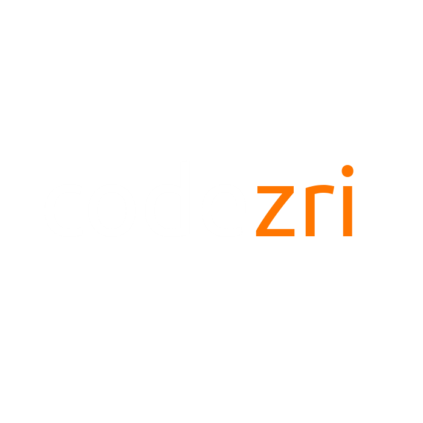

# design-guide

CodeZri design resources for promotions and referencing

## Identity

For referencing and promoting the CodeZri organization, please use the following names:

- CodeZri (Not codeZri or Codezri)
- codezri
- CodeZri.org

- Tagline: Portable and lightweight cross platform desktop app development framework
- Official website: https://neutralino.js.org
- GitHub organization: https://github.com/codezri

## Referencing guide

- Use the GitHub organization link for technical contexts (i.e., Technical articles, blog posts, and forum posts)
- Use the official website link for generic or promotional use cases (i.e., Social media posts, graphical materials, and videos)

## Logo

Graphic design credits: Canva

## License

[CC0-1.0](LICENSE)

